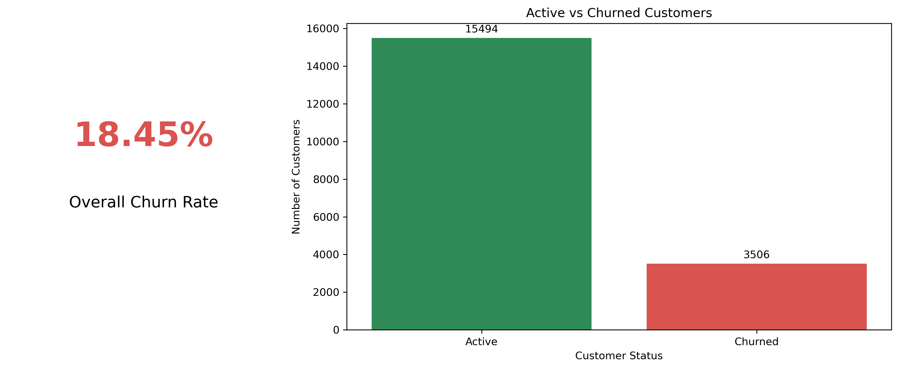
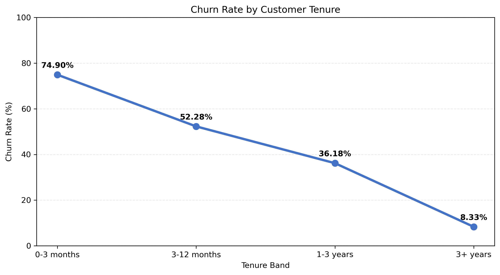
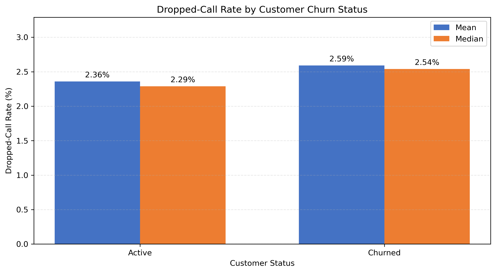

# NexaTel Customer Churn Analytics

## Project Overview

This project analyzes NexaTel customer data to identify churn patterns, revenue risks, and retention opportunities. Python was used for data cleaning, exploratory analysis, and KPI calculations. Power BI was used to create an interactive five-page dashboard.

## Tools Used

* Python
* Pandas and NumPy
* Matplotlib and Seaborn
* Jupyter Notebook
* Power BI
* DAX
* Power Query

## Key Findings

* Overall customer churn rate is 18.45%.
* Customer retention rate is 81.55%.
* Revenue lost to churn is approximately ₹186,178.64.
* Churn is highest during the first six months of customer tenure.
* Mass-segment customers have the highest churn rate.
* Unresolved complaints and poor network quality are important retention risks.
* Mizoram has the highest state-level churn rate.

## Project Files

* `Phase1_DataCleaning_Archana_Arya.ipynb` – Data cleaning and quality checks
* `Phase2_EDA_Archana_Arya.ipynb` – Exploratory data analysis
* `Phase3_KPI_Calculations_Archana_Arya.ipynb` – KPI calculations
* `Phase4_Dashboard_Archana_Arya.pbix` – Interactive Power BI dashboard
* `Phase4_Report_Archana_Arya.pdf` – Management summary report
* PNG files – Project charts and visualizations

## Sample Visualizations

## Recommendations

1. Create an onboarding and retention program for customers within their first six months.
2. Prioritize Mass and Value customers with high revenue and short tenure.
3. Contact customers with unresolved complaints before they decide to leave.
4. Improve network service in high-churn states and areas with frequent dropped calls.
5. Track retention campaign results monthly and focus investment on the strongest campaigns.

## Author

**Archana Arya**
Aspiring Data Analyst | Python | SQL | Power BI | Excel
